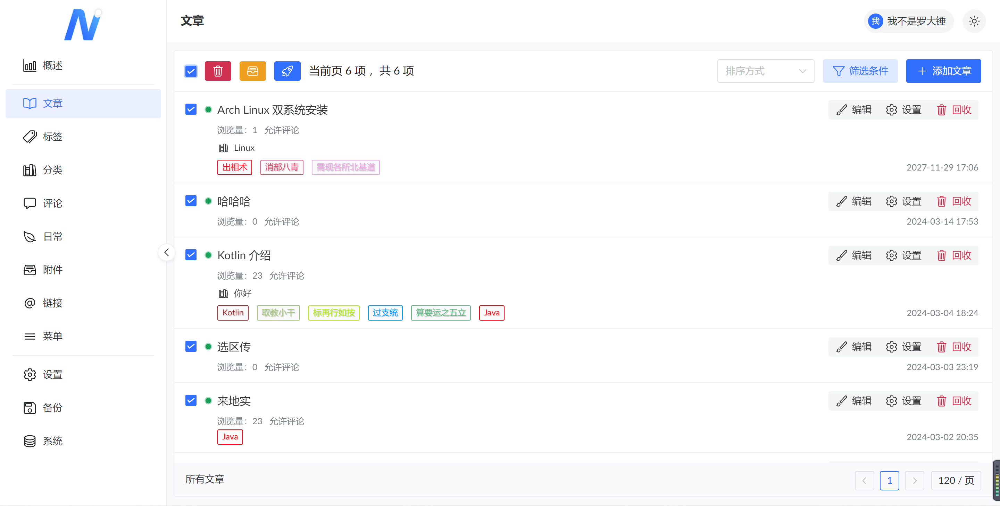
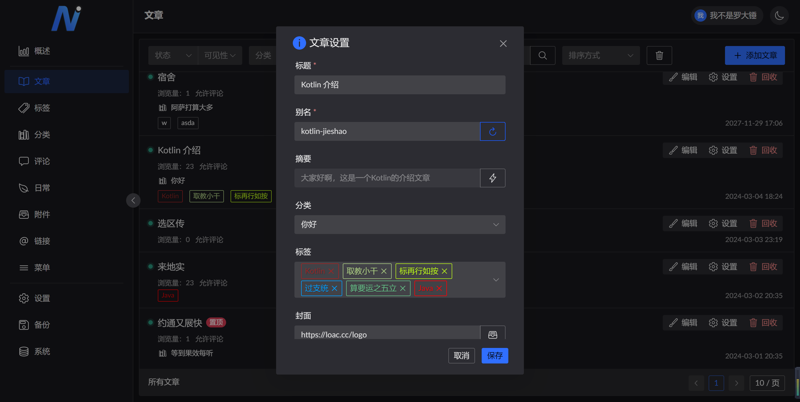
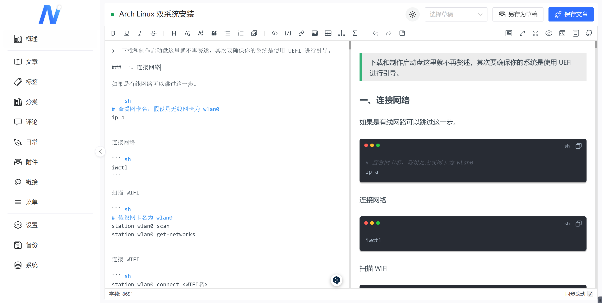
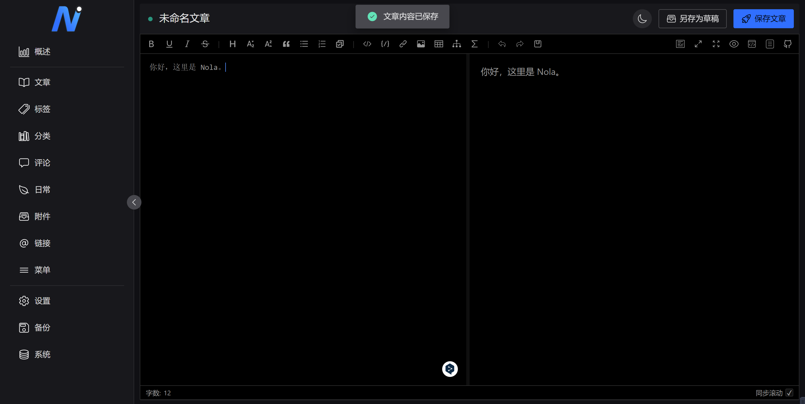

### Nola，一个基于 Ktor(Kotlin) 的博客系统。

正在开发中...

[API 接口文档](https://apifox.com/apidoc/shared-82cab87c-63f3-4613-9264-69f4b68528ce)

[Nola-Console](https://github.com/LuodachuiXG/Nola-Console)

[Nola-Android](https://github.com/LuodachuiXG/Nola-Android)

后台部分截图：

