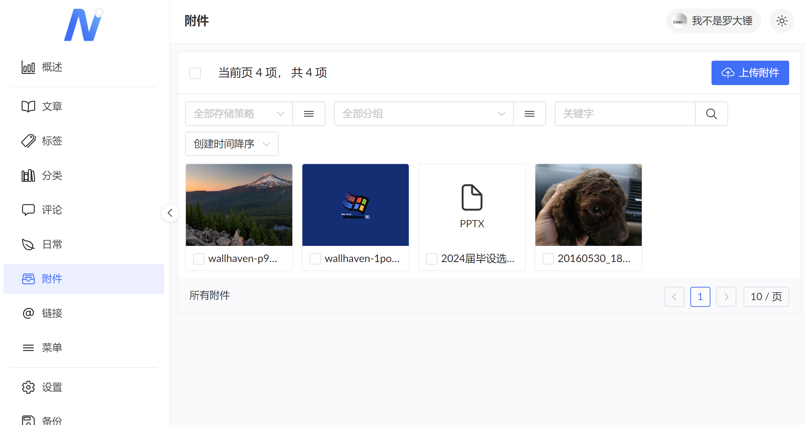
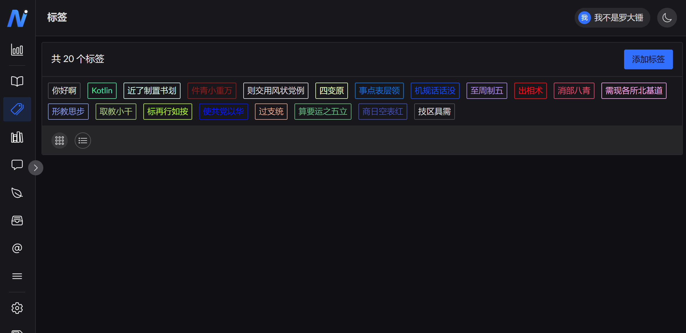
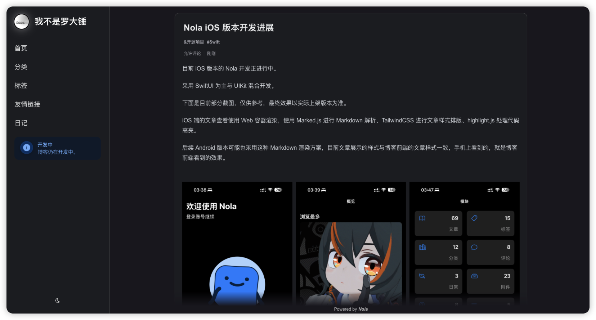
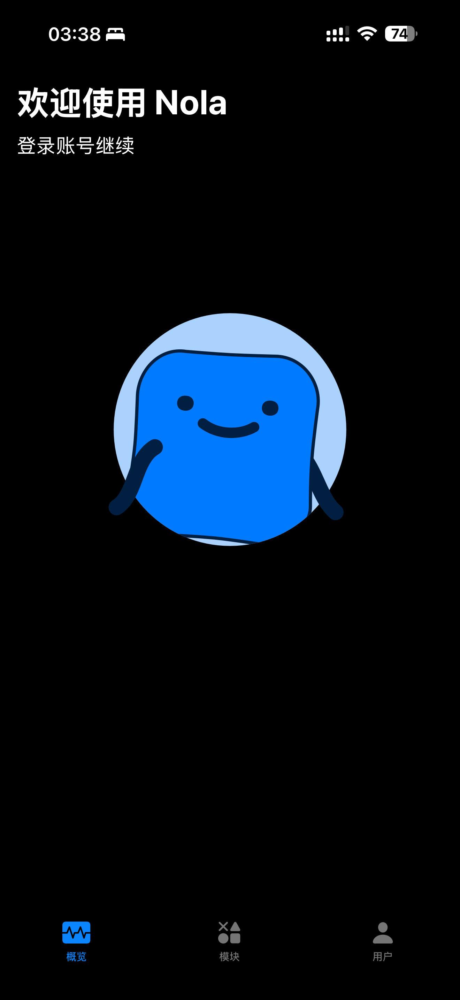

### Nola，一个基于 Ktor(Kotlin) 的博客系统（开发中...）。

博客预览（开发中）：[loac.cc](https://loac.cc)

Nola 博客采用完全前后端分离开发，本体就是当前 Nola 仓库，只提供了博客的一些常用的接口，没有内嵌博客前端页面。

Nola 没有采用传统的使用模板引擎然后用后端服务渲染后将页面给前端的方式（一开始考虑过，后来还是做成完全分离，博客前端单独做）。

Nola 内嵌了一个 Web 控制面板，在跑起来 Nola 后可以通过访问 [http://localhost:8098/console](http://localhost:8098/console) 进行博客的初始化和管理。

目前博客仍在开发阶段，部分配置可能还需要手动在项目静态文件中修改，后续会提供更方便的配置方式。

### 一、🔨 运行 Nola

1. 首先你需要先 clone 本仓库到本机。
2. 使用 IDEA 打开项目，并完成 Gradle 依赖加载。
3. 修改 `/resources/application.conf` 文件中的数据库配置（无需修改 Redis 配置，目前暂时还没有集成 Redis，未来备用）。
4. 从 `Application.kt` 中的 `main` 方法运行 Nola。
5. 访问 [http://localhost:8098/console](http://localhost:8098/console) 完成博客初始化。

### 二、🔨 Nola 博客前端页面

Nola 并没有内嵌博客前端页面，你需要拉取 [Nola-Blog](https://github.com/LuodachuiXG/nola-next-blog) 仓库后在本地编译运行后才可以正常看到前端页面。

[Nola-Blog](https://github.com/LuodachuiXG/nola-next-blog) 使用 Next.js 进行开发，支持服务端渲染。

1. 首先 clone [Nola-Blog](https://github.com/LuodachuiXG/nola-next-blog) 仓库到本地。
2. 使用你喜欢的前端 IDE 打开项目。
3. 打开根目录中的 `.env.development` 文件，在里面配置你的 Nola 服务器地址（默认 http://localhost:8098 无需修改）。
4. 运行 `npm install` 拉取依赖。
5. 运行 `npm run dev` 运行。

### 三、🔩 Nola API 文档

Nola 有详细的 API 文档，使用 Apifox 进行编写，API 文档地址：[API 文档](https://apifox.com/apidoc/shared-82cab87c-63f3-4613-9264-69f4b68528ce)

### 四、🛠 其他相关仓库

1. Nola 博客前端页面：[Nola-Blog](https://github.com/LuodachuiXG/nola-next-blog)
   - Next.js 框架，支持服务端渲染。使用 [HeroUI](https://www.heroui.com/) 组件库 + [TailwindCSS](https://tailwindcss.com/) 进行UI 开发。
2. Nola 控制台页面：[Nola-Console](https://github.com/LuodachuiXG/Nola-Console)
   - Vue3 框架。使用 [Naive UI](https://www.naiveui.com/zh-CN/os-theme)（后续可能更换重写）。
3. Nola Android 端：[Nola-Android](https://github.com/LuodachuiXG/Nola-Android)
   - 目前处于新建文件夹阶段，预计使用 Jetpack Compose 进行开发。
4. Nola Apple 端：[Nola-iOS](https://github.com/LuodachuiXG/Nola-Apple)
   - SwiftUI 为主 + UIKit 混合开发，目前进度 40% 左右，应该会较于 Android 版本更早完成。

### 五、📷 部分截图

由于目前仍在开发中，截图仅供参考。

#### 1. Nola 控制台

#### 2. Nola 博客前端

#### 3.Nola Apple 端

